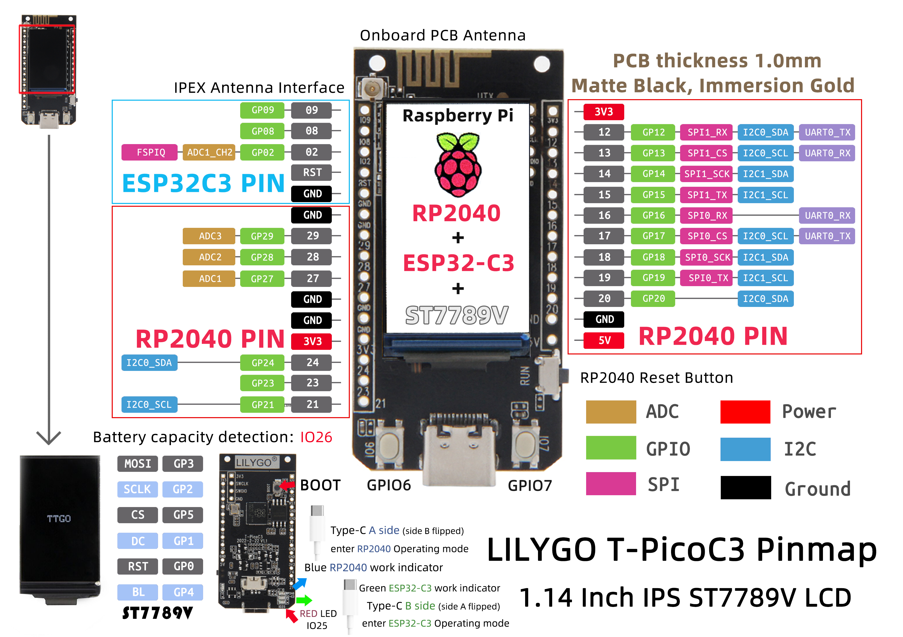

# "Hello world" program for the T-PicoC3

Project to bootstrap the use of [LilyGo T-Pico-C3](https://github.com/Xinyuan-LilyGO/T-PicoC3) with its TFT display.

It presents a simple clock with minutes and seconds displayed, being implemented using hardware timers.

For reference, here's the pinout of the board:

# License

[Apache 2.0](LICENSE)
